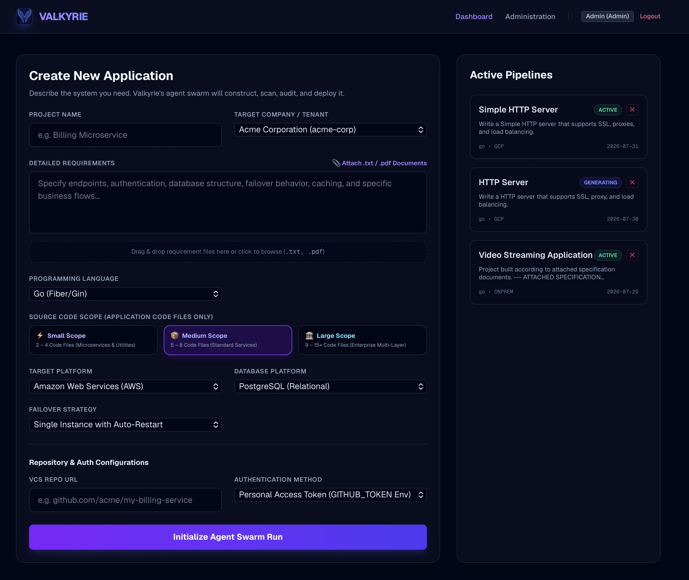
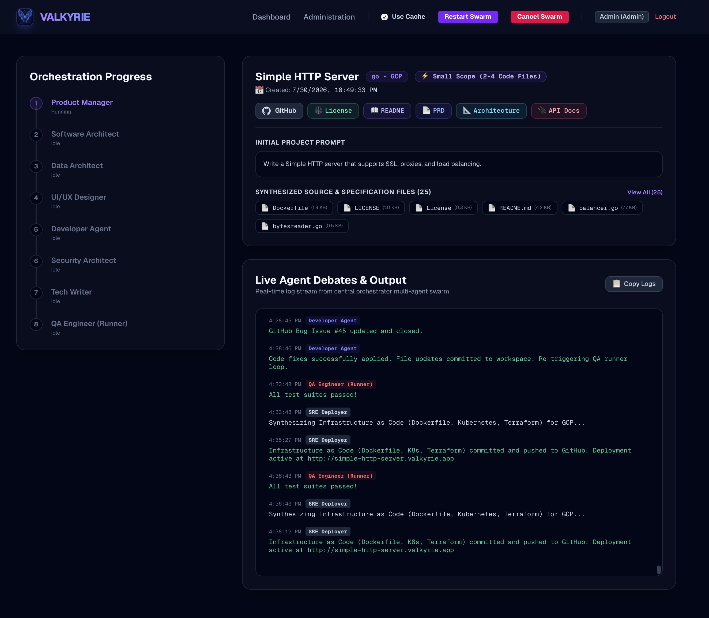

<p align="center">
  
</p>

# Valkyrie Swarm Orchestrator Backend

The Orchestrator manages the execution flow of the AI pipeline. It parses developer configs, triggers sequential agent generation loops, validates code integrity, records telemetry & per-file costs, proxies LLM completions, and synthesizes Infrastructure as Code (IaC) manifests.

---

## 📸 Swarm Execution & Telemetry Screenshots

<p align="center">
  
</p>

<br />

<p align="center">
  
</p>

---

## 🛠️ Key Architectural Features

1. **High-Performance Fastify Engine**: Powered by **Fastify 5**, providing high-throughput REST route handling, low overhead, and asynchronous Server-Sent Events (SSE) log streaming.
2. **6-Language Multi-Framework Support**: Synthesizes production code for **Go**, **TypeScript**, **Python**, **Java (Spring Boot/Maven)**, **C++ (CMake)**, and **C# (.NET 8)**.
3. **Sequential Swarm Workflow**: Spawns specialized agents for PM, Software Architect, Data Architect, UI/UX Designer, Codebase Developer, Security Architect, Tech Writer, QA Engineer, and SRE Deployer.
4. **SRE Deployer IaC Synthesis**: Automatically generates `Dockerfile`, `docker-compose.yml`, `deploy/k8s/deployment.yaml`, and `deploy/terraform/main.tf` upon QA sign-off and commits them to GitHub.
5. **Per-File Cost & Token Tracking**: Logs prompt and completion tokens plus USD cost for every synthesized file, persisted in `docs/manifest.json`.
6. **Immediate Remote Pushes**: Codebase changes are committed and pushed to the project's GitHub repository immediately after synthesis and updated post-QA/SRE stages.
7. **Self-Healing Loop**: Receives test reports from the QA Runner. If tests fail, automatically submits GitHub bug issues, triggers Developer Agent code fixes, and closes issues with commit links.
8. **Multi-API Provider Engine**: Supports Google (Gemini), Anthropic (Claude), OpenAI (GPT), and Ollama (local server).

---

## 🔌 API Reference Guide

### 🚀 Swarm Executions
* **`POST /api/projects/run`**: Initializes a project run. Parses tenant scopes, VCS preferences, projectScope (small/medium/large), caching toggles, and boots the pipeline.
* **`GET /api/projects/:id/status`**: Queries the active pipeline step (`status` string).
* **`GET /api/projects/:id/stream`**: Establishes a Server-Sent Events (SSE) connection streaming real-time console logs and project state.
* **`GET /api/projects/:id/files`**: Returns a JSON array containing all generated files and contents.
* **`GET /api/projects/:id/file?path=...`**: Fetches content, line count, and size for a specific file path.
* **`POST /api/projects/:id/approve`**: Approves planning documents (`AWAITING_APPROVAL` gate) to initiate developer synthesis.
* **`POST /api/projects/:id/llm`**: Proxies LLM completions using active provider settings.

### 🧪 QA Reports
* **`POST /api/projects/:id/qa-report`**: Triggered by the QA Runner CLI to submit pass/fail status, stdout, and error details. If `passed` is false, registers a GitHub issue and spawns a background fix job.

### 🔒 Admin Panel Controls
* **`GET /api/admin/settings`**: Loads active model, provider, keys, and endpoint configurations (Admin only).
* **`POST /api/admin/settings`**: Updates and saves global Swarm configuration preferences (Admin only).
* **`POST /api/admin/companies`**: Provisions a new company organization (required `id` slug parameter).
* **`GET /api/admin/companies`**: Lists all registered companies.
* **`GET /api/admin/companies/:id/projects`**: Lists all project profiles associated with a company.
* **`POST /api/admin/users`**: Provisions a user profile with role bindings.

---

## 🚀 Execution & Containerization Instructions

### Local Development
Run the server independently from the orchestrator folder:
```bash
# Start backend server
npm run dev
```
By default, the backend listens on port `4000`.

---

### 🐳 Docker Container Build & Push (Linux AMD64)

1. **Build Container Image for `linux/amd64`:**
   ```bash
   # Run from workspace root
   docker build --platform linux/amd64 -t valkyrie-orchestrator:latest -f Dockerfile.backend .
   ```

2. **Push to Registry:**
   * **Docker Hub**:
     ```bash
     docker tag valkyrie-orchestrator:latest <your-username>/valkyrie-orchestrator:latest
     docker push <your-username>/valkyrie-orchestrator:latest
     ```
   * **GitHub Container Registry (GHCR)**:
     ```bash
     docker tag valkyrie-orchestrator:latest ghcr.io/<your-username>/valkyrie-orchestrator:latest
     docker push ghcr.io/<your-username>/valkyrie-orchestrator:latest
     ```

3. **Run Container (`docker run`):**
   ```bash
   docker run -d \
     --name valkyrie-orchestrator \
     -p 4000:4000 \
     --env-file .env \
     -v valkyrie-generated-data:/app/generated \
     valkyrie-orchestrator:latest
   ```

